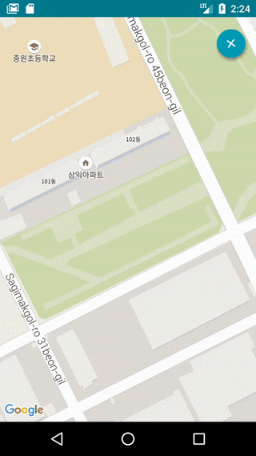
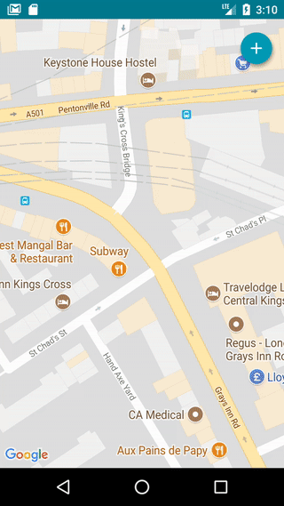
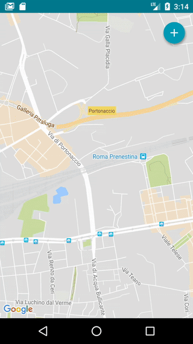

# Easy Photo Map

[](https://github.com/unicodeveloper/awesome-opensource-apps)
[](https://github.com/KotlinBy/awesome-kotlin)
[![License][licensesvg]][LICENSE.md]   

  

Easy Photo Map is a photomap application that displays the location of the photo on the map using the location information included in the photo.  

# Screen Shot
&nbsp;
&nbsp;
&nbsp;
&nbsp;
&nbsp;
&nbsp;
<br />
&nbsp;
&nbsp;
&nbsp;

# How to build
```
Step1. Fork or download 'aaf-easyphotomap' project.
Step2. Import 'aaf-easyphotomap' project into android studio.
Step3. Register your package name and SHA-1 signature certificate fingerprint for Google Map use.(https://console.developers.google.com/)
Step4. Define api key to 'google_maps_api.xml' file.
       - /app/src/release/res/values/google_maps_api.xml
Step5. Build 'aaf-easyphotomap' project with android studio.
```

# Project Tree
```
├─java
│  └─me
│      └─blog
│          └─korn123
│              └─easyphotomap
│                  ├─activities
│                  │      AboutActivity.kt
│                  │      AddressSearchActivity.kt
│                  │      AppPreferenceActivity.kt
│                  │      BatchPopupActivity.kt
│                  │      CameraActivity.kt
│                  │      FileExplorerActivity.kt
│                  │      IntroActivity.kt
│                  │      MapsActivity.kt
│                  │      PhotoSearchActivity.kt
│                  │      PopupImageActivity.kt
│                  │      SettingsActivity.kt
│                  │      SimpleActivity.kt
│                  │      ThumbnailExplorerActivity.kt
│                  │      TimelineActivity.kt
│                  │      
│                  ├─adapters
│                  │      AddressItemAdapter.kt
│                  │      ExplorerItemAdapter.kt
│                  │      RecommendationItemAdapter.kt
│                  │      SearchItemAdapter.kt
│                  │      ThumbnailItemAdapter.kt
│                  │      TimelineItemAdapter.kt
│                  │      
│                  ├─constants
│                  │      Constant.kt
│                  │      
│                  ├─dialogs
│                  │      ChangeSortingDialog.kt
│                  │      
│                  ├─extensions
│                  │      Activity.kt
│                  │      Context.kt
│                  │      
│                  ├─helper
│                  │      Config.kt
│                  │      Constants.kt
│                  │      EasyPhotoMapApplication.kt
│                  │      PhotoMapDbHelper.kt
│                  │      PhotoMapMigration.kt
│                  │      RegistrationThread.kt
│                  │      
│                  ├─models
│                  │      FileItem.kt
│                  │      PhotoMapItem.kt
│                  │      ThumbnailItem.kt
│                  │      
│                  ├─thumbnail
│                  │      AsyncDrawable.kt
│                  │      BitmapWorkerTask.kt
│                  │      
│                  └─utils
│                          AsyncUtils.kt
│                          BitmapUtils.kt
│                          CommonUtils.kt
│                          DialogUtils.kt
│                          FontUtils.kt
│                          GPSUtils.kt
│                          
└─res
    ├─drawable
    │      bg_button.xml
    │      bg_recommendation_card.xml
    │      circle_marker.xml
    │      circle_timeline.xml
    │      divider_card.xml
    │      frame_02.jpg
    │      frame_03.jpg
    │      ic_fast_scroll.xml
    │      ic_fast_scroll_default.xml
    │      ic_fast_scroll_press.xml
    │      ic_selector.xml
    │      ic_selector_default.xml
    │      ic_selector_press.xml
    │      intro.png
    │      selector_listview.xml
    │      
    ├─drawable-hdpi
    │      delete.png
    │      folder.png
    │      ic_camera.png
    │      ic_edit.png
    │      ic_folder_01.png
    │      ic_image.png
    │      ic_map_marker.png
    │      ic_marker.png
    │      ic_menu_gallery.png
    │      ic_photos.png
    │      ic_search.png
    │      ic_settings.png
    │      ic_timeline.png
    │      redo_2.png
    │      undo_2.png
    │      
    ├─drawable-mdpi
    │      delete.png
    │      folder.png
    │      ic_camera.png
    │      ic_edit.png
    │      ic_folder_01.png
    │      ic_image.png
    │      ic_map_marker.png
    │      ic_marker.png
    │      ic_menu_gallery.png
    │      ic_photos.png
    │      ic_search.png
    │      ic_settings.png
    │      ic_timeline.png
    │      
    ├─drawable-v21
    │      ic_selector.xml
    │      
    ├─drawable-xhdpi
    │      bg_common.xml
    │      delete.png
    │      folder.png
    │      ic_camera.png
    │      ic_edit.png
    │      ic_folder_01.png
    │      ic_image.png
    │      ic_map_marker.png
    │      ic_marker.png
    │      ic_menu_gallery.png
    │      ic_photos.png
    │      ic_search.png
    │      ic_settings.png
    │      ic_timeline.png
    │      redo_2.png
    │      undo_2.png
    │      
    ├─drawable-xxhdpi
    │      delete.png
    │      folder.png
    │      ic_camera.png
    │      ic_edit.png
    │      ic_folder_01.png
    │      ic_image.png
    │      ic_map_marker.png
    │      ic_marker.png
    │      ic_menu_gallery.png
    │      ic_photos.png
    │      ic_search.png
    │      ic_settings.png
    │      ic_timeline.png
    │      redo_2.png
    │      undo_2.png
    │      
    ├─layout
    │      activity_address_search.xml
    │      activity_batch_popup.xml
    │      activity_camera.xml
    │      activity_file_explorer.xml
    │      activity_intro.xml
    │      activity_maps.xml
    │      activity_photo_search.xml
    │      activity_popup_image.xml
    │      activity_settings.xml
    │      activity_thumbnail_explorer.xml
    │      activity_timeline.xml
    │      dialog_change_sorting.xml
    │      item_address.xml
    │      item_file_explorer.xml
    │      item_recommendation.xml
    │      item_search.xml
    │      item_thumbnail.xml
    │      item_timeline.xml
    │      popup_window_camera.xml
    │      popup_window_photo_map_info.xml
    │      popup_window_recommendation.xml
    │      
    ├─menu
    │      file_explorer.xml
    │      menu.xml
    │      setting_menu.xml
    │      thumbnail_explorer_menu.xml
    │      
    ├─mipmap-anydpi-v26
    │      ic_launcher.xml
    │      ic_launcher_round.xml
    │      
    ├─mipmap-hdpi
    │      ic_launcher.png
    │      ic_launcher_foreground.png
    │      ic_launcher_round.png
    │      
    ├─mipmap-mdpi
    │      ic_launcher.png
    │      ic_launcher_foreground.png
    │      ic_launcher_round.png
    │      
    ├─mipmap-xhdpi
    │      ic_launcher.png
    │      ic_launcher_foreground.png
    │      ic_launcher_round.png
    │      
    ├─mipmap-xxhdpi
    │      ic_launcher.png
    │      ic_launcher_foreground.png
    │      ic_launcher_round.png
    │      
    ├─mipmap-xxxhdpi
    │      ic_launcher.png
    │      ic_launcher_foreground.png
    │      ic_launcher_round.png
    │      
    ├─values
    │      colors.xml
    │      dimens.xml
    │      ic_launcher_background.xml
    │      strings.xml
    │      styles.xml
    │      
    ├─values-en
    │      strings.xml
    │      
    ├─values-ja
    │      strings.xml
    │      
    ├─values-ko
    │      strings.xml
    │      
    └─xml
            provider_paths.xml
```

# License
[LICENSE][LICENSE.md]

[licensesvg]: https://img.shields.io/badge/License-Apache--2.0-brightgreen.svg
[LICENSE.md]: https://github.com/hanjoongcho/aaf-easyphotomap/blob/master/LICENSE.md
