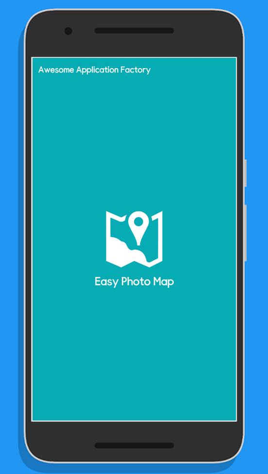
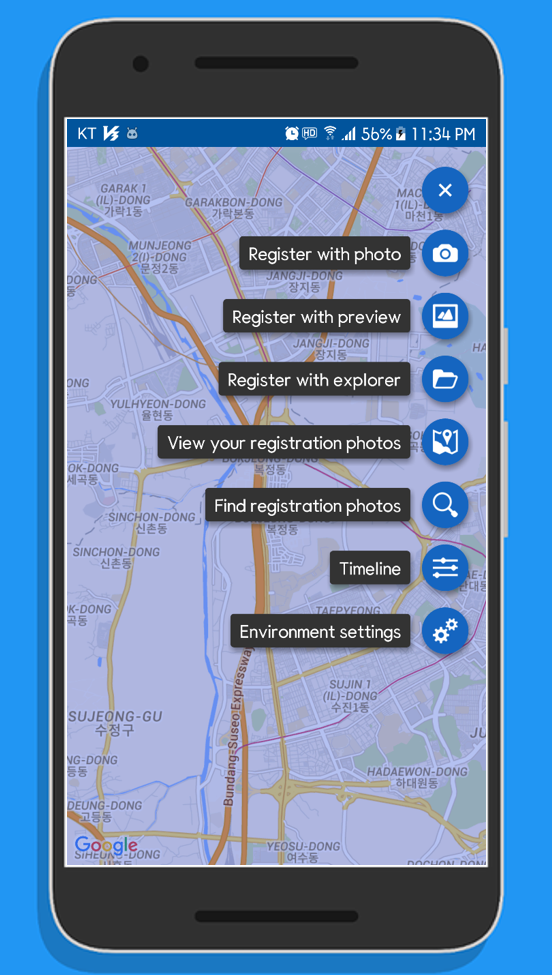
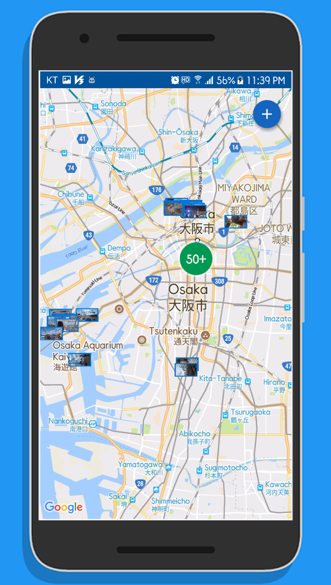
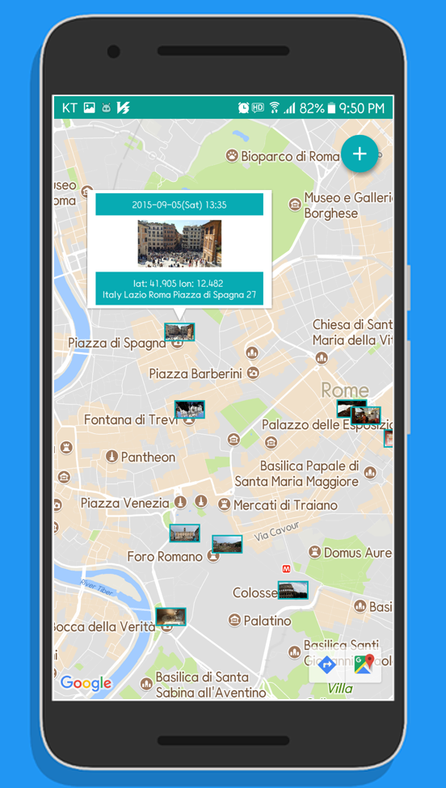
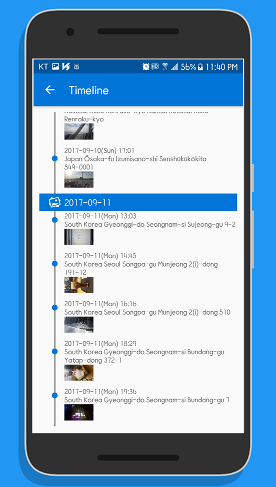
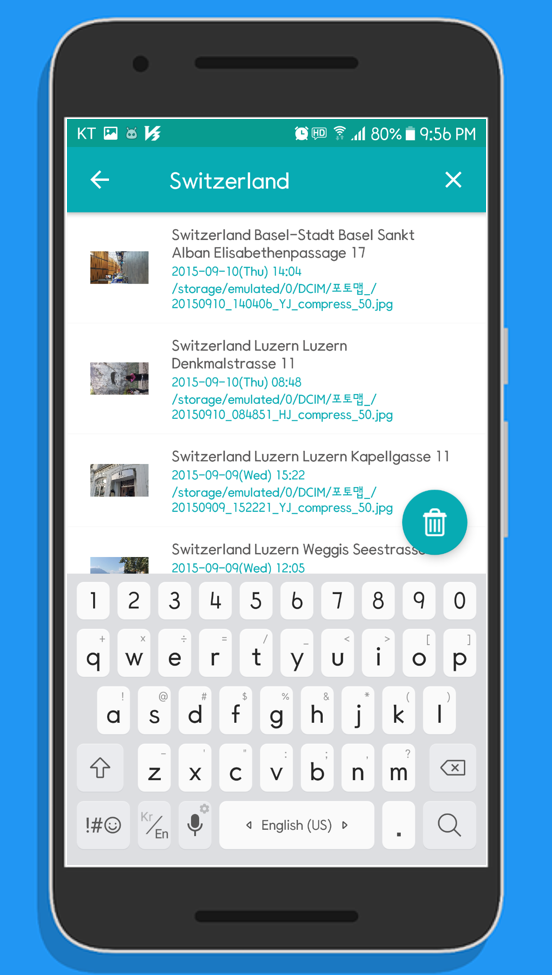
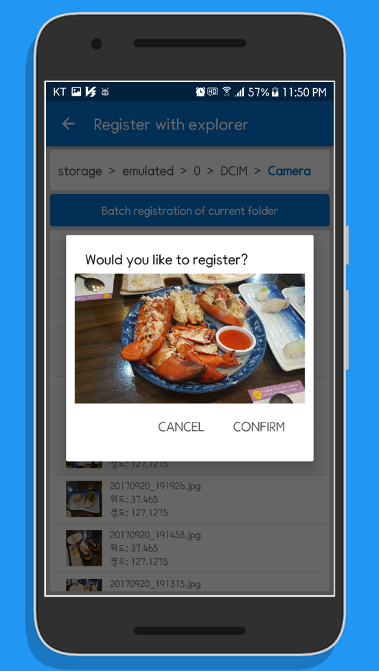

# Easy Photo Map

[![License][licensesvg]][LICENSE.md]  
  

Easy Photo Map is a photomap application that displays the location of the photo on the map using the location information included in the photo.  
Latest version can be download from the link below.  
<a href='https://play.google.com/store/apps/details?id=me.blog.korn123.easyphotomap'></a><br />

# Precautions
The current version of code has a part that has failed to follow the Android coding convention, and there is also a redundant code.
I will continue refactoring whenever i have spare time.

# Screen Shot
&nbsp;
&nbsp;
&nbsp;
&nbsp;
&nbsp;
&nbsp;
&nbsp;

# How to build
```
Step1. Fork or download 'aaf-easyphotomap' project.
Step2. Import 'aaf-easyphotomap' project into android studio.
Step3. Register your package name and SHA-1 signature certificate fingerprint for Google Map use.(https://console.developers.google.com/)
Step4. Define api key to 'google_maps_api.xml' file.
       - /app/src/release/res/values/google_maps_api.xml
Step5. Build 'aaf-easyphotomap' project with android studio.
```

# License
[LICENSE][LICENSE.md]

[licensesvg]: https://img.shields.io/badge/License-Apache--2.0-brightgreen.svg
[LICENSE.md]: https://github.com/hanjoongcho/aaf-easyphotomap/blob/master/LICENSE.md